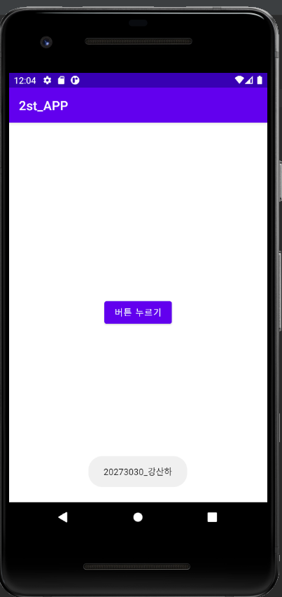
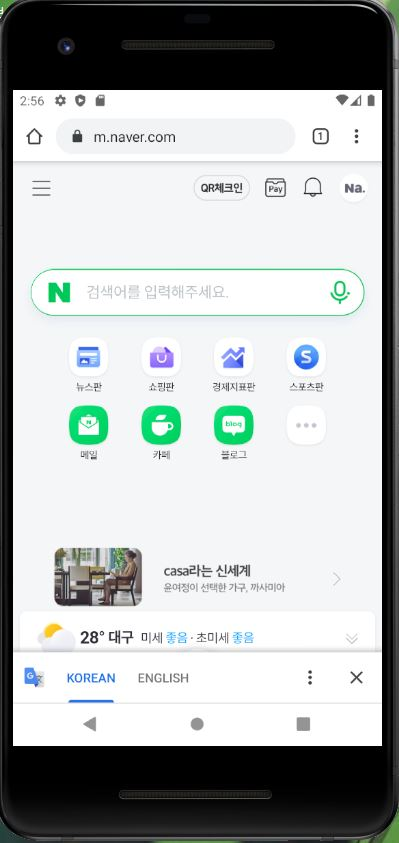
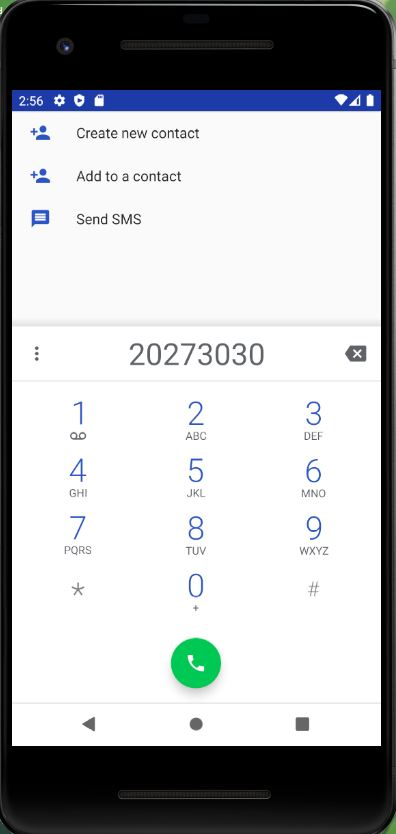

# 2021년 2학기 캡스톤디자인 안드로이드앱 프로그래밍

## 2주차 수업 
  - Github사용방법
  - 안드로이드앱프로그래밍
  - 앱기획

 </img>

 </img>

## 3주차 과제

 </img>
 </img>

## 4주차 과제

내가 만들고 싶은 앱 기획 아이디어 : 영화, 드라마 등을 평가하는 앱

  외국 영화뿐만 아니라 한국 영화나 드라마 등을 리뷰한 것을 한곳에서 볼 수 있는 곳이 생각보다 없는 것 같아서 조금 더 편리하게 볼 수 있도록 만들어보고 싶습니다.
  - 영화나 드라마에 대한 별점과 리뷰를 할 수 있다.
  - 리뷰와 별점을 통해 보고 싶은 것을 쉽게 고를 수 있다.
  - 실시간 순위를 한눈에 보기 쉽다.
  - 자신이 좋아하는 장르를 추천받을 수도 있고 검색을 통해 배우가 출연한 영화와 드라마를 한눈에 볼 수 있다.
